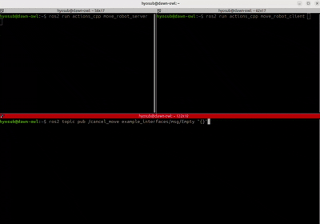

# 🤖 Move Robot Action - ROS 2 (C++)

A simple ROS 2 project demonstrating **Action communication** with feedback and cancel functionality.



## 📦 Features

- Action Server/Client written in C++
- Real-time feedback (robot position updates)
- Goal cancellation via topic (`/cancel_move`)
- Custom `.action` definition

## 🧪 How to Run

### 1. Build the workspace

```bash
cd ~/move_robot_ws
colcon build
source install/setup.bash
```

### 2. Run the nodes

# Terminal 1
ros2 run actions_cpp move_robot_server

# Terminal 2
ros2 run actions_cpp move_robot_client

# Terminal 3 (to cancel)
ros2 topic pub /cancel_move example_interfaces/msg/Empty "{}"

### 📁 Package Structure
```
move_robot_ws/
├── src/
│   ├── robot_interfaces/
│   │   └── action/MoveRobot.action
│   └── actions_cpp/
│       ├── src/
│       │   ├── move_robot_client.cpp
│       │   └── move_robot_server.cpp
```

